# Lab 1 : Build Alexa device on a MCU

In this lab, you will learn how to create a Alexa Voice Product. Then you will create the AWS resources required for the upcoming labs. 

## <span style="color:orange"> You will build step 1a of this architecture :</span>


## A.  Identify Serial number of the NXP kit and configure WiFi

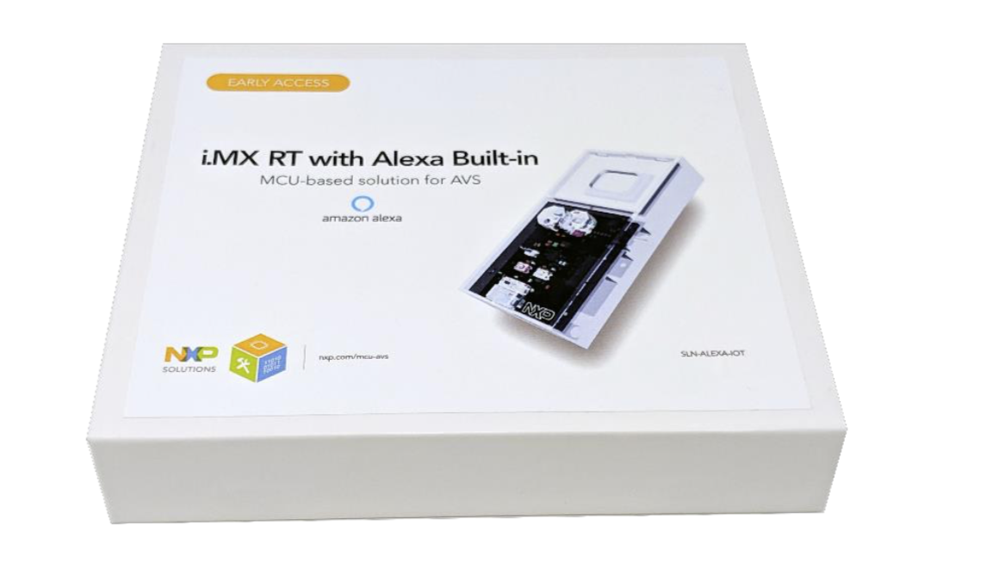

## <span style="color:orange"> You need to establish serial connection to the device : </span>

### 1. Please connect both the USB ports to the adapter provided, and connect the adapter to the laptop

    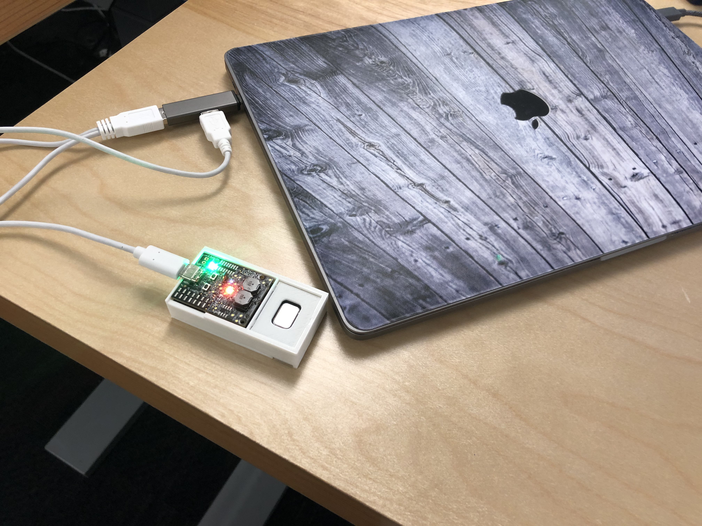 

### 2. Connect to the hardware kit using the below instructions

2. Connect to the hardware kit using the below instructions -
    -   Mac -  [screen](./serial.md)
    -   Windows - [putty](./serial.md)
    -   Linux -  [screen / minicom](./serial.md)

### 3. Device Serial number and WiFi configuration

Please enter the following commands on your serial terminal.

    ```
    serial_number

setup <your wifi ssid> <your wifi password>
    ```
You should obtain information similar to the screenshot below


Please **record** device serial number before you setup the WiFi as the device will restart.  
    If you experience strange behaviour in the MacOS Terminal, please issue following commands
    
    ```
    stty sane
    stty erase [press the Backspace key]
    ```

## B.  Create AWS resources 

### 1. Login to your [AWS Console](https://console.aws.amazon.com/console/home)

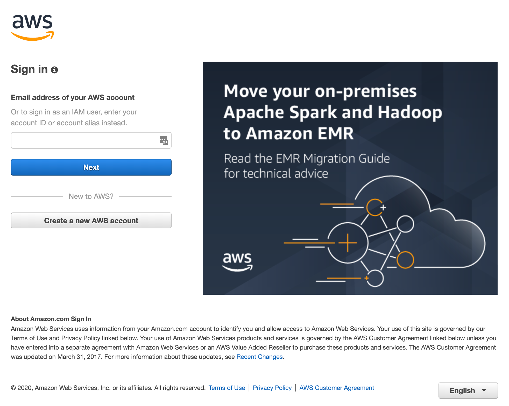

### 2. Click here to create [cloudformation-stack-eu-west-1](https://console.aws.amazon.com/cloudformation/home?region=eu-west-1#/stacks/create/review?stackName=AWS-NXP-Alexa-workshop&templateURL=https://aws-nxp-alexa-workshop.s3-eu-west-1.amazonaws.com/templates/avs-iot-cfn.yaml)
 
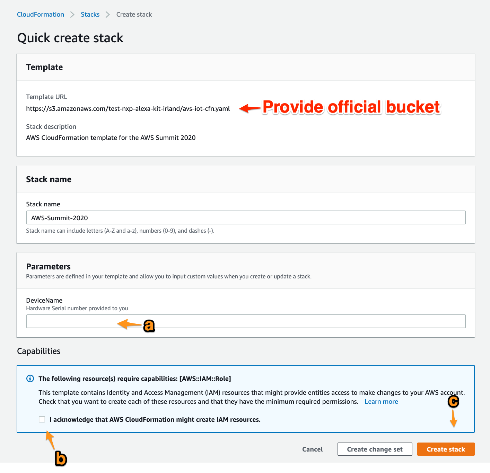

a. Enter device serial number without '='
    
b. Validate ressource requirement

c. Create the stack

<span style="color:orange">The cloudformation will take between 3-5 mins to complete. Once complete</span>
    
### 3. Configure your Thing from [AWS IoT Console](https://console.aws.amazon.com/iot/)

- Click Get started (if prompted)

#### 3.1: Navigate to your Thing
    
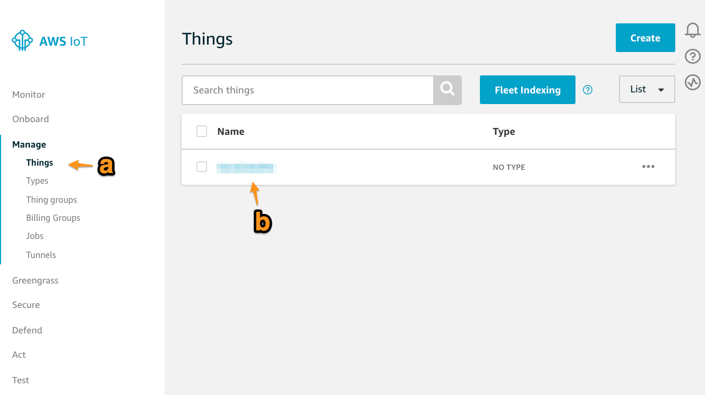

a. On the menu, select Manage -> Things

b. Click on your device name

#### 3.2: Create device certificate

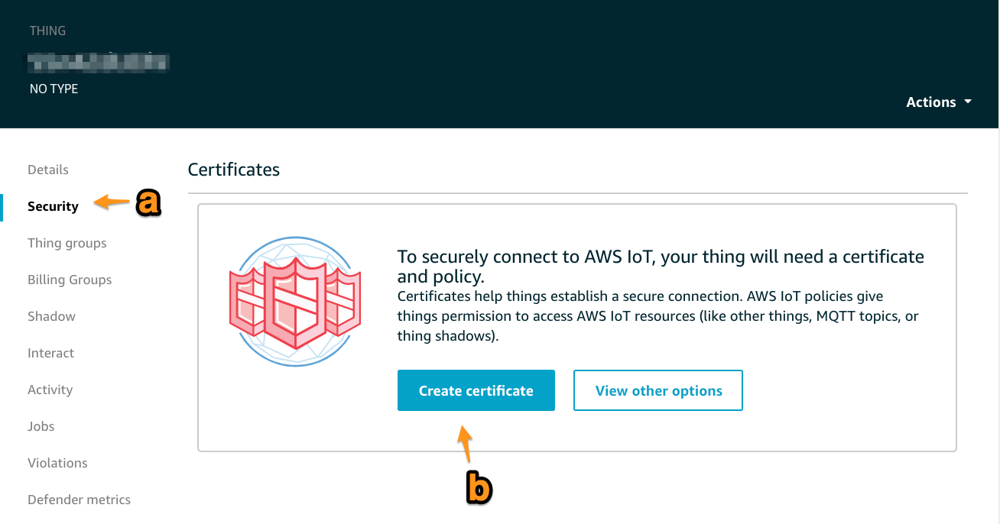

a. On the menu, select Security
    
b. Click on "Create certificate"
    
#### 3.3: Download and activiate the new certificate
    
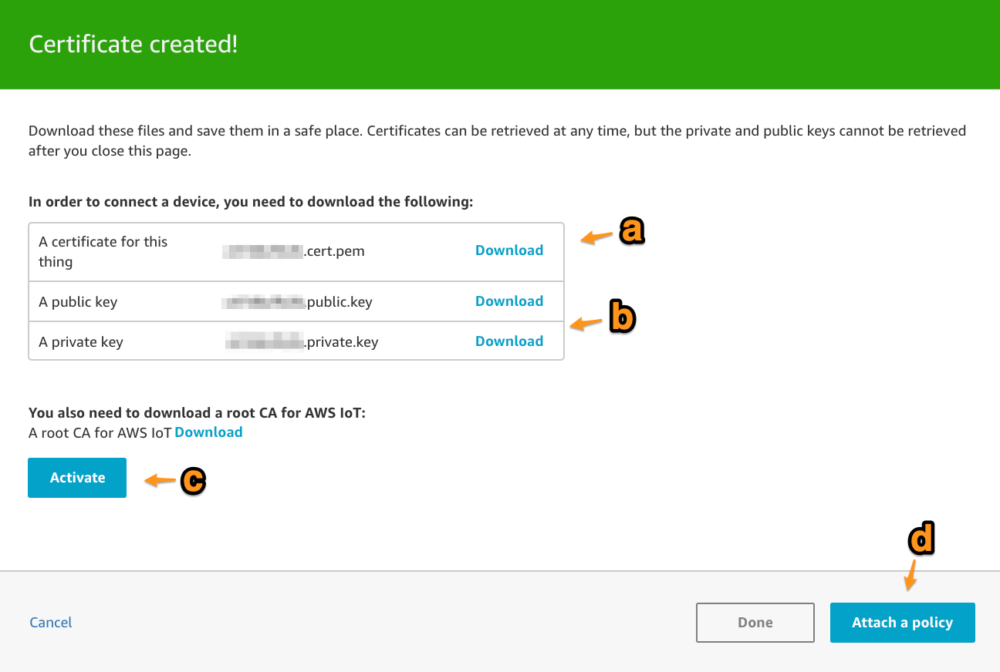
    
a. Click on "Download" to save locally the certificate
    
b. Click on "Download" to save locally private key
    
c. Click on "Activate" to enable the certificate on IOT Core
    
d. Click on "Attach a policy"
    
#### 3.4: Attach policy to your cert
    
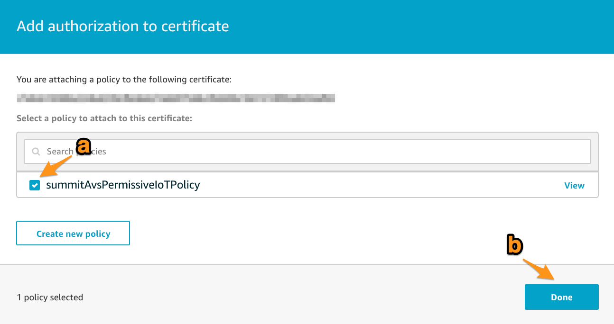
    
a. Select the certificate "summitAvsPermissionIoTPolicy"

b. Click on Done to finish the certificate configuration
    
#### 4. Please navigate to the [AWS IoT Console](https://console.aws.amazon.com/iot/)           

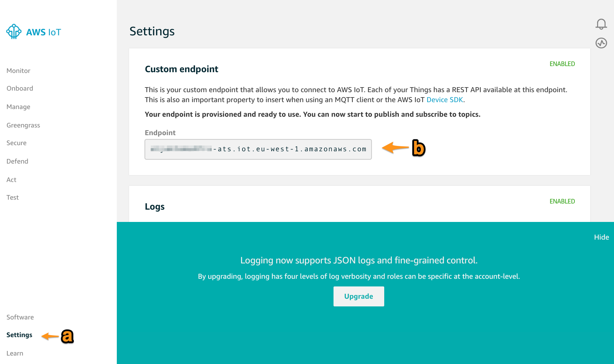

a. On the menu, select Settings

b. Copy the IOT endpoint for later NXP firmware configuration.

## C. Create AVS Product  

After you've created an Amazon developer account, you'll need to create a product and security profile. This will enable your hardware kit (NxP) to connect to Alexa Voice Service.

Log in to [AVS console](https://developer.amazon.com/alexa/console/avs/home). 

If this is your first time using AVS, you'll see a welcome screen. Click the GET STARTED button, then click the CREATE PRODUCT button.

If you're a returning developer, click the Products -> CREATE PRODUCT button at the top right corner of the screen.

## <span style="color:orange"> Fill in product information</span>

### 1. Product Name: MQTT for AVS

### 2. Product ID: PrototypeIoT

### 3. Please Select Your Product Type: Device with Alexa Built-in

    Will your device use a companion app?  **No**

    

### 4. Product Category: Other (Please specify)

    - Enter Value: Prototype

### 5. Brief Product description: Prototype

### 6. How will users interact with your product? : Hands-free

    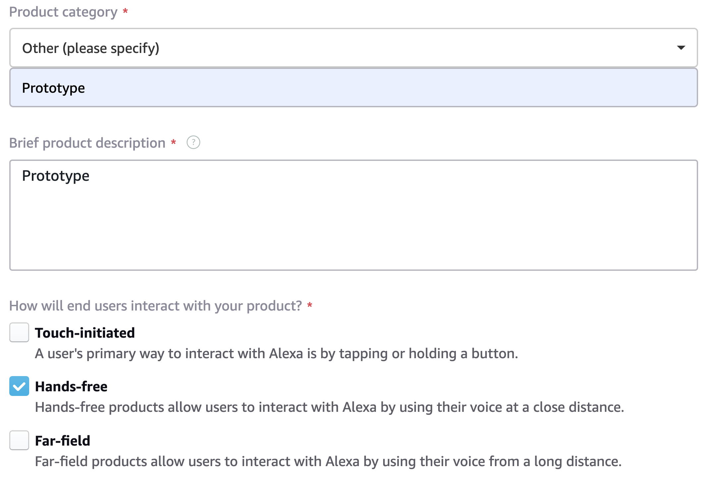

### 7. **Skip** the Upload an image step. This is not required for prototyping

### 8. Select the options as below and click Next to Continue

    

<span style="color:orange">Please use the AWS Account # you copied in Step A.1</span>

### 9. Click **CREATE NEW PROFILE**


    - Security Profile Name: **MQTT for AVS Profile**
    - Security Profile Description: AVS IoT Workshop
    - Click NEXT.

    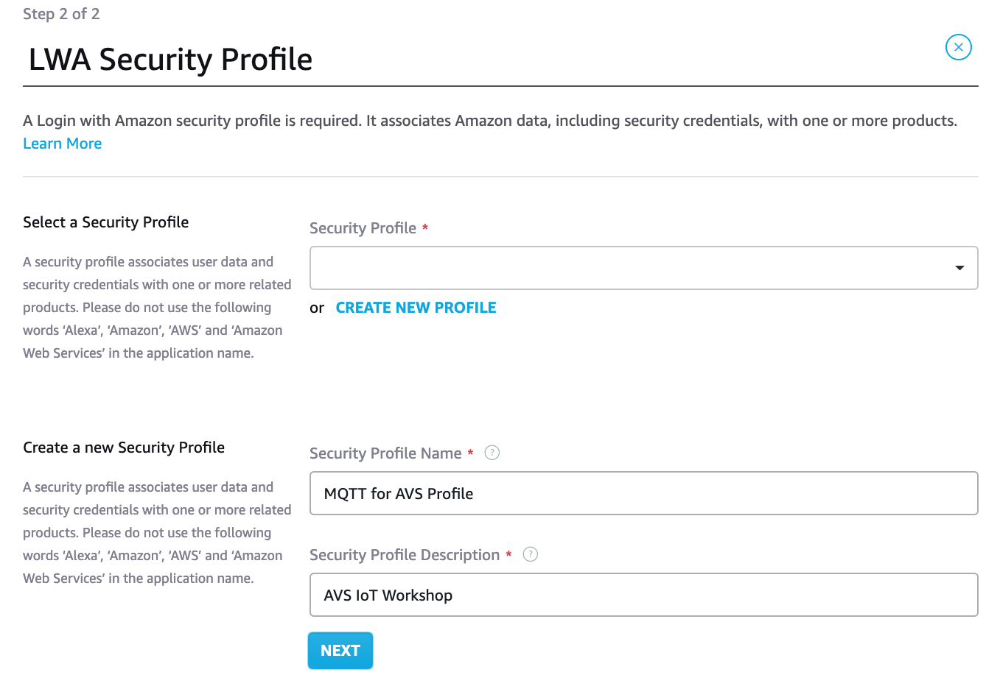

    **Security Profile ID** will be generated for you.

### 11. Select **Other devices and platforms** in the **Platform Information** section.

    - Client ID name -  **Prototype**
    - Click **Generate ID** and **Download**
    - You will need **clientId** and **productId** available inside the downloaded file in the next section
    - Check the box **I agree to the AVS ..** and Click **FINISH**.

    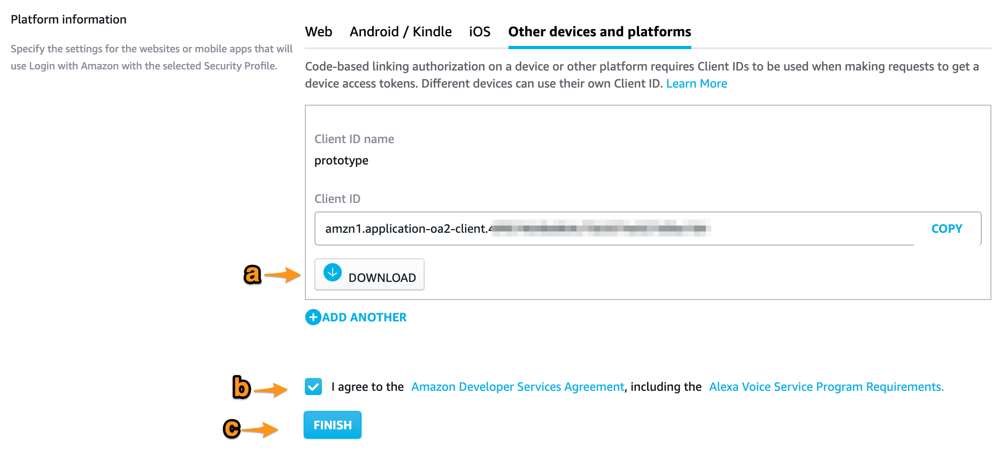

<span style="color:orange">You will get the message, Product has been created. Click Ok and move to section B.</span>
    <font color="orange">In the next lab you will need the following from this lab : </font>
    
    - AVS Client ID and Product ID available in the downloaded config.json file from Section A - Step 11

    - AWS IoT Endpoint Url from Section B - Step 4

Congratulations! You now have created the Alexa Voice Product and the AWS resources. In the next lab , you will embed these configurations on the hardware , so they can communicate with Alexa Voice service and AWS IoT services. 

### See you in [lab2](./lab2.md). 


