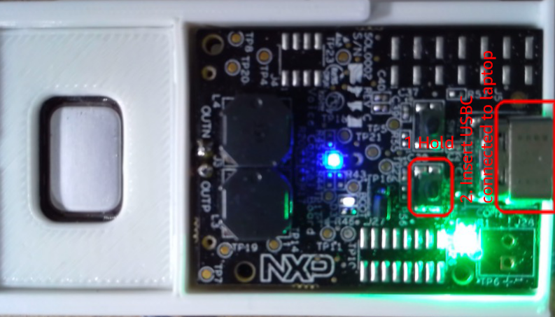
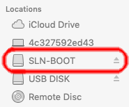
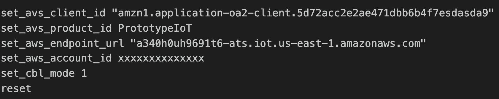
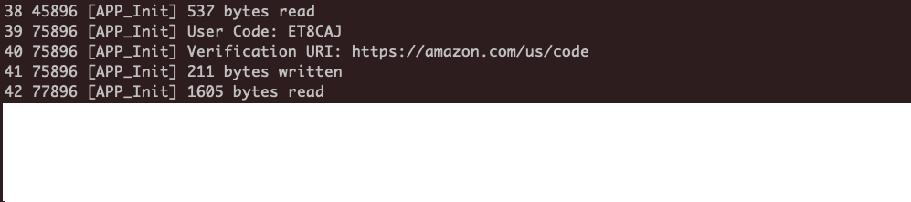
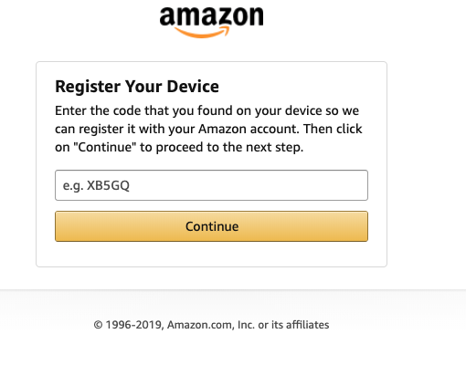
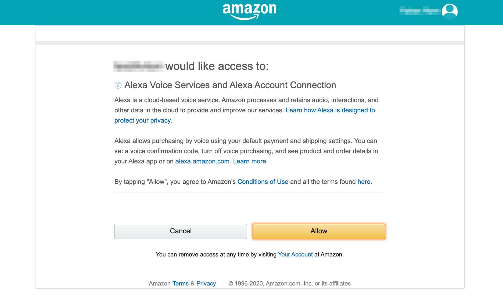
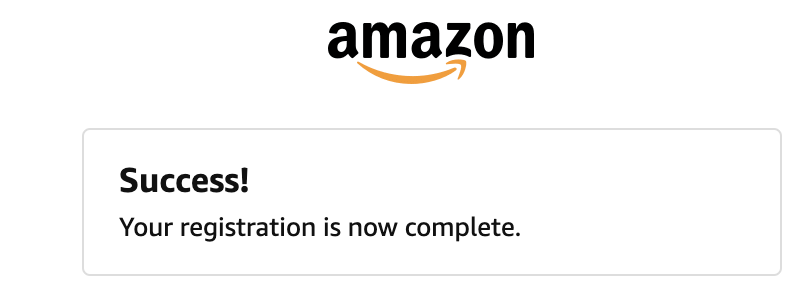
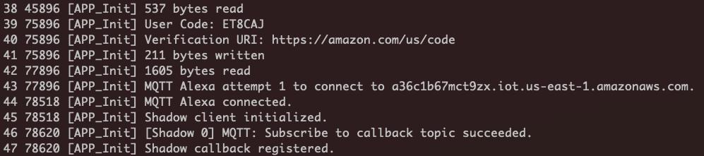

# Lab 2 : Enable Alexa on the NxP MCU kit

In this lab, you will learn how to configure the NxP microcontroller kit to connect to Alexa Voice service and AWS IoT Core. You will start to use Alexa voice commands on the kit. 

## <span style="color:orange"> You will continue to build step 1a of this architecture :</span>


## A. Upload certificate and private key to the device

### 1. Upload the **certificate** to the device

- disconnect the cable from the device
- hold the button marked SW2 (see the picture) and at the same time insert the USB-C cable into the device. Release the button only when the LED light turn purple



- the device will appear in Finder (Mac) or File Explorer (Windows) as SLN-BOOT volume.



- drag the certificate file to SLN-BOOT volume. Device will install certificate and reset. (Observe the LED light)
- when device will stop flashing orange unplug the power.

### 2. Upload the **private key** by repeating the steps in section 2, but with private key file.

## B. Configure the NxP kit with Alexa

## <span style="color:orange"> Establish serial connection to the device : </span>

### 1. Connect to the hardware kit using the below instructions (same as in Lab 1)

2. Read the below and then run the commands to configure the kit to connect to Alexa Voice Services and AWS IoT services. 
    
### 2. Read the below and then run the commands to configure the kit to connect to Alexa Voice Services and AWS IoT services

- **Client id** and **Product Id** is required for the kit to successfully authenticate to Alexa Voice service
- **AWS Account ID** and **Endpoint URL** is required for the kit to successfully authenticate to AWS IoT core
- Therefater you enable [**code based linking**](https://developer.amazon.com/docs/alexa-voice-service/code-based-linking-other-platforms.html) for registering this kit to your Amazon Developer account
- Reset reboots the device with the latest configurations

Please enter the following commands **One by One** in your serial terminal.

    ```
set_avs_client_id "Client id available in config.json obtained in Lab1-C.11"

set_avs_product_id "Alexa Product ID available in config.json obtained in Lab1-C.11"

set_aws_endpoint_url "IoT Endpoint obtained in Lab1-B.4.b"

set_aws_account_id "AWS ACCOUNT ID"

    set_cbl_mode 1

    reset
    ```

You should obtain information similar to the screenshot below



### 3. Enable debugging information

    Please give few seconds for the device to restart , and connect back to the device using serial command again , and run the below. 

    - Enable USB logging to monitor the device interaction with AWS IoT Core and AVS
    - When you talk to Alexa, this console will print the device activity 
    
    ```
      enable_usb_log
      logs
    ```

**If serial terminal is not accessible, please power cycle the device.**

You will get the User code and the URL from the console

     

### 4. Copy the user code from the logs and navigate to [amazon.code](https://amazon.com/us/code) on your browser to authenticate

- Login with the same email ,if prompted, that you used for the Alexa developers console prior in Lab1-C
- Paste the user code and submit.
     
- Allow AVS connection

- And Voilà


### 5. Check back on the serial terminal

    - Device will periodically check for a token, may take up to 60 seconds
    - After that it will register and be ready to use.
    - The log will show if any errors. 

     

    <span style="color:orange"> If connection and auth is successful , the board will only have the power green led on.
    
     

## <span style="color:green"> Try Alexa, time in Paris </span>

**And get to know about the fantastic timeclock in Paris.**

## C.  Navigate to AWS IoT console 

Please login to the [AWS IoT Console](https://console.aws.amazon.com/iot/) and select **Manage** (on the left pane) -> Things

1. Check if you can see the Thing created with the serial # of your NxP kit (on the right pane)
2. Click on **Monitor** (left pane) and check on the graphs (in the right pane) for successfull Connections.  

To learn more about AVS Integration for AWS IoT, please click [here](https://developer.amazon.com/docs/alexa-voice-service/avs-for-aws-iot-overview.html).

<span style="color:orange">Please keep the board muted. Press the switch SW1 on the board , and it will mute and turn on the red led. 
</span>

 

Congratulations! You now have access to the Alexa Voice Service APIs from your hardware and able to see connection of the hardware from AWS IoT console. 

### See you in [lab3](./lab3.md). 


